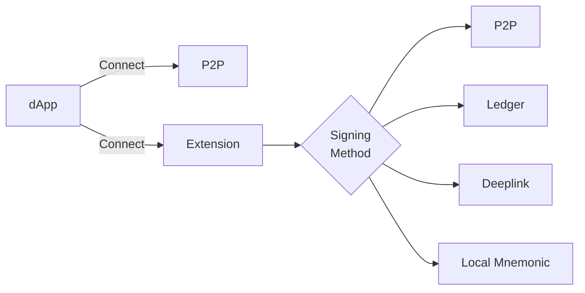

```mermaid
graph LR
    A[dApp] -->|Connect| B[P2P]
    A[dApp] -->|Connect| C[Extension]
    C --> D{Signing<br/>Method}
    D --> E[P2P]
    D --> F[Ledger]
    D --> G[Deeplink]
    D --> H[Local Mnemonic]
```

The different flows are defined in the flows folder.