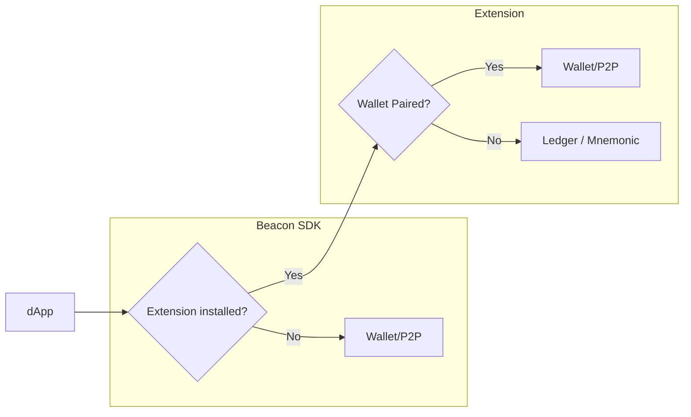

## Communication

```mermaid
graph LR
    Z[dApp] --> Y{Extension installed?}
    subgraph Beacon SDK
      Y -- No --> B[Wallet/P2P]
    end
    subgraph Extension
      X -- Yes --> E[Wallet/P2P]
      X -- No --> D[Ledger / Mnemonic]
      Y -- Yes --> X{Wallet Paired?}
    end
```
