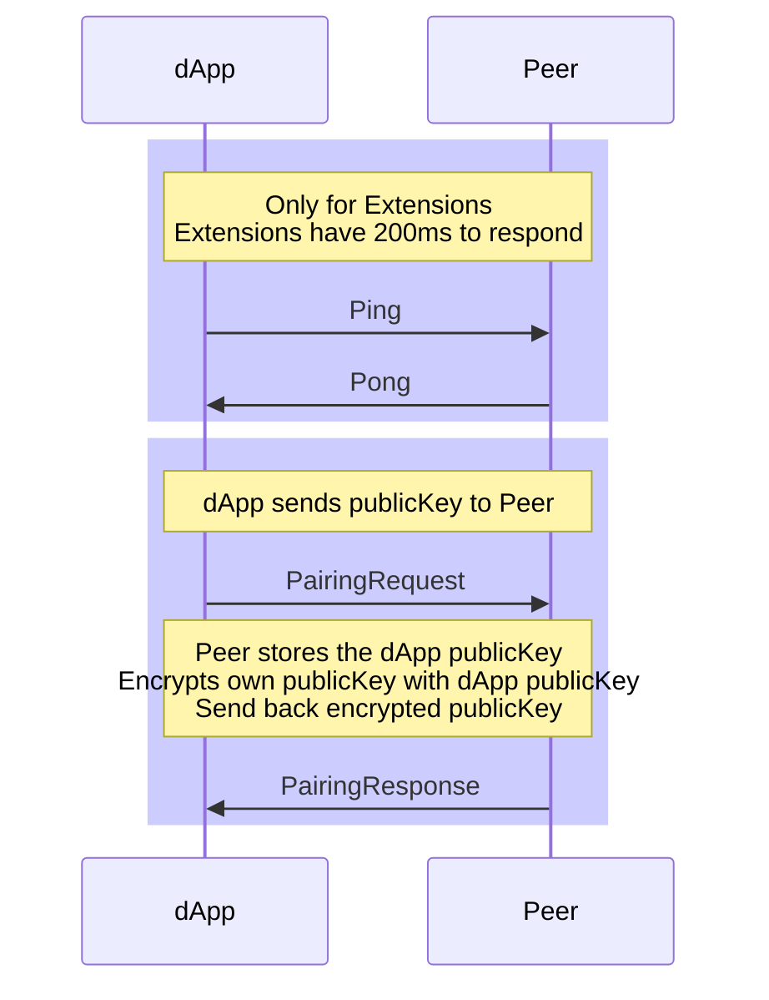
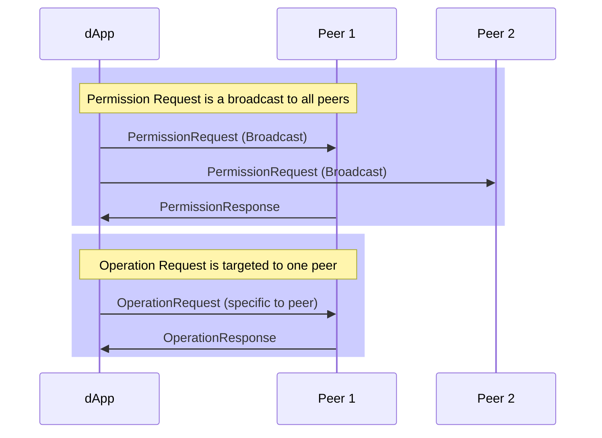

## Extension Communication

```mermaid
sequenceDiagram
  rect rgba(0, 0, 255, .2)
    Note over dApp,Peer: Only for Extensions<br />Extensions have 200ms to respond
    dApp->>Peer: Ping
    Peer->>dApp: Pong
  end

  rect rgba(0, 0, 255, .2)
    Note over dApp,Peer: dApp sends publicKey to Peer
    dApp->>Peer: PairingRequest
    Note over dApp,Peer: Peer stores the dApp publicKey <br/> Encrypts own publicKey with dApp publicKey <br/> Send back encrypted publicKey
    Peer->>dApp: PairingResponse
  end
```

```mermaid
sequenceDiagram
  rect rgba(0, 0, 255, .2)
    Note over dApp,Peer 1: Permission Request is a broadcast to all peers
    dApp->>Peer 1: PermissionRequest (Broadcast)
    dApp->>Peer 2: PermissionRequest (Broadcast)
    Peer 1->>dApp: PermissionResponse
  end

  rect rgba(0, 0, 255, .2)
    Note over dApp,Peer 1: Operation Request is targeted to one peer
    dApp->>Peer 1: OperationRequest (specific to peer)
    Peer 1->>dApp: OperationResponse
  end
```
