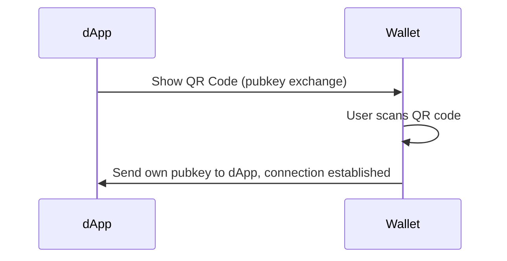
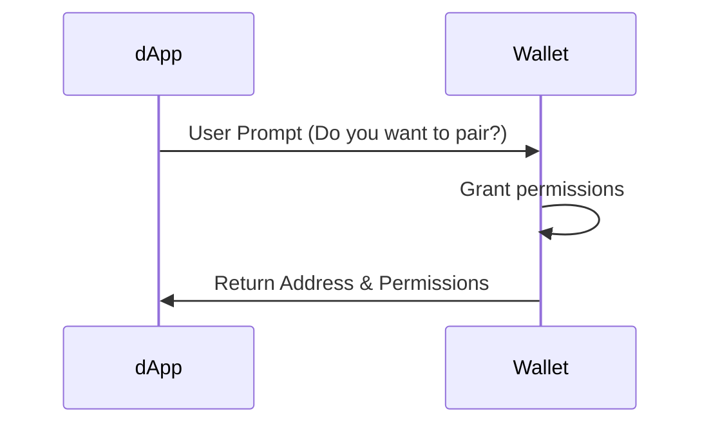
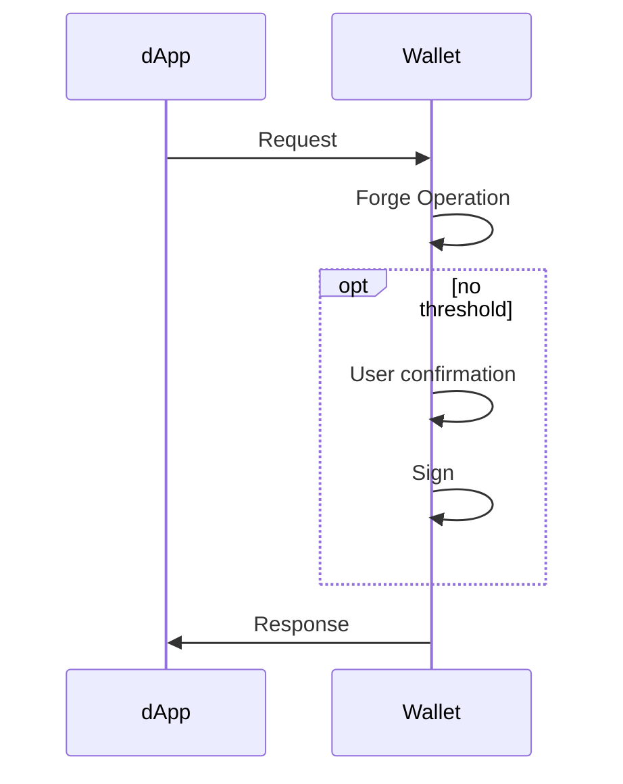
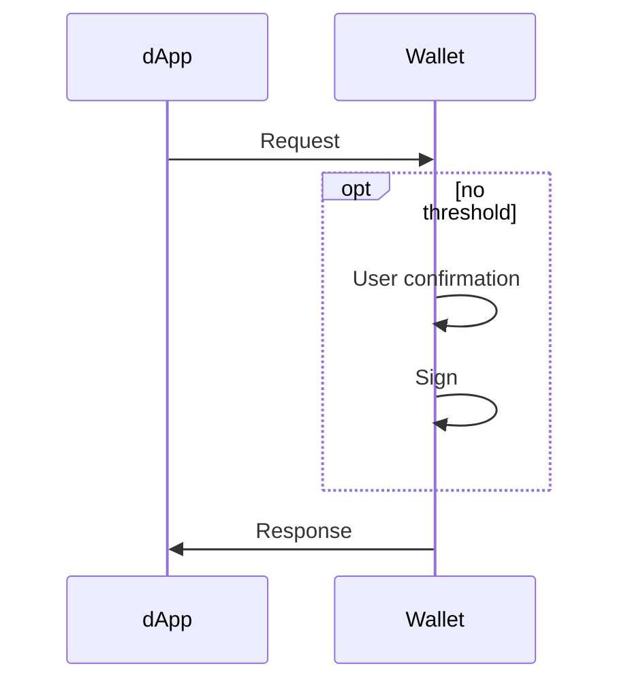
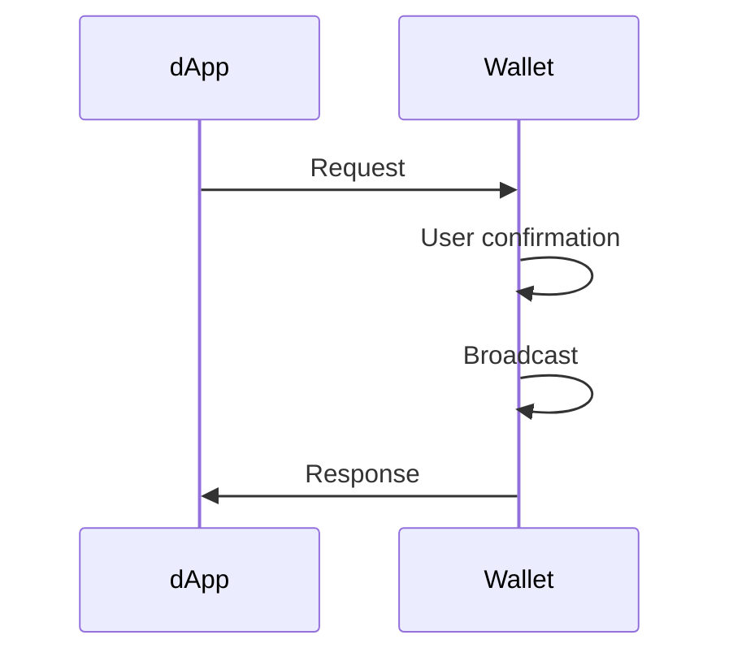

# P2P Direct Flow (Direct)

## Init

## Permission Request

## Operation Request

## Signing Request

| WARNING: Can threshold be abused to sign contract calls? |
| -------------------------------------------------------- |

## Broadcast Request

