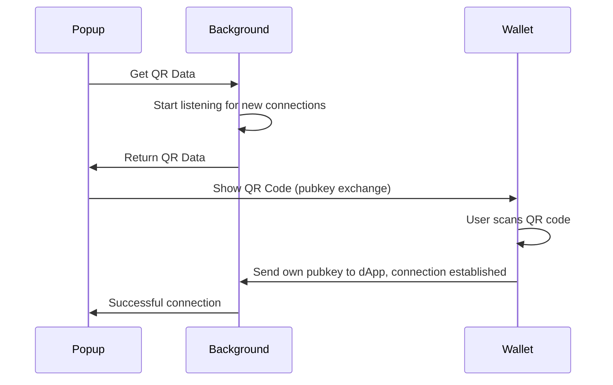
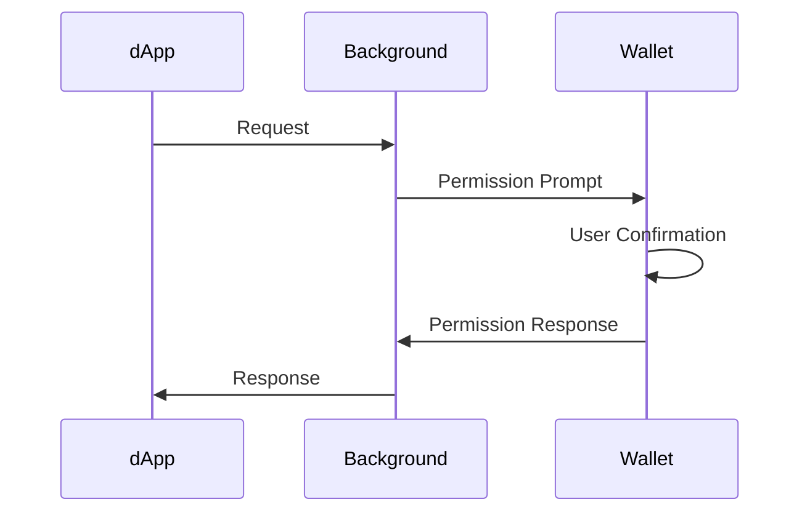
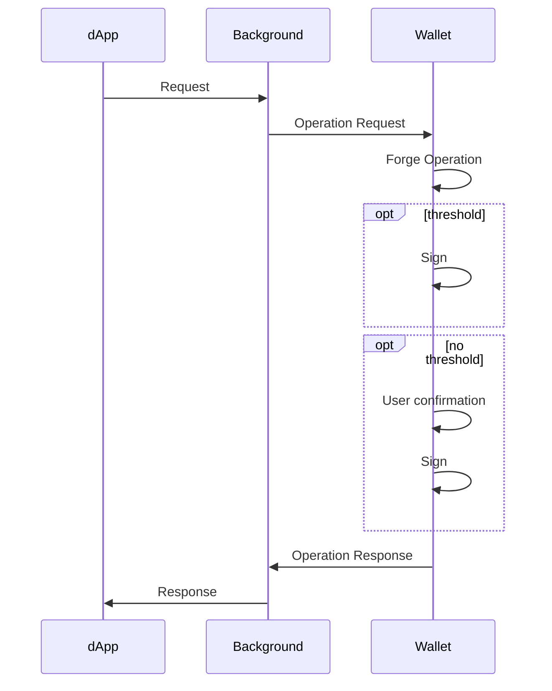
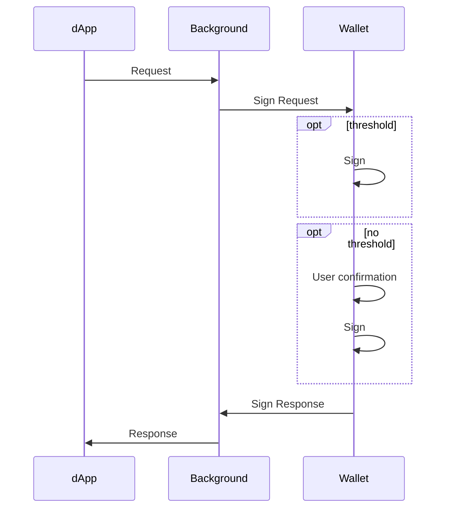
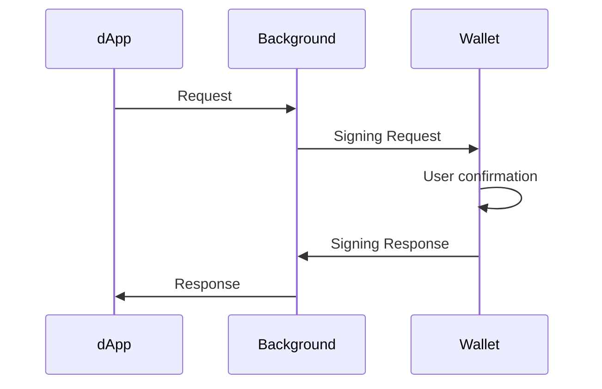

# Wallet Flow

## Init

```mermaid
sequenceDiagram
    Popup->>Background: Get QR Data
    Background->>Background: Start listening for new connections
    Background->>Popup: Return QR Data
    Popup->>Wallet: Show QR Code (pubkey exchange)
    Wallet->>Wallet: User scans QR code
    Wallet->>Background: Send own pubkey to dApp, connection established
    Background->>Popup: Successful connection
```

## Permission Request

```mermaid
sequenceDiagram
    dApp->>Background: Request

    Background->>Wallet: Permission Prompt
    Wallet->>Wallet: User Confirmation
    Wallet->>Background: Permission Response

    Background->>dApp: Response
```

## Operation Request

```mermaid
sequenceDiagram
    dApp->>Background: Request
    Background->>Wallet: Operation Request
    Wallet->>Wallet: Forge Operation

    opt threshold
        Wallet->>Wallet: Sign
    end
    opt no threshold
        Wallet->>Wallet: User confirmation
        Wallet->>Wallet: Sign
    end
    Wallet->>Background: Operation Response
    Background->>dApp: Response
```

## Signing Request

```mermaid
sequenceDiagram
    dApp->>Background: Request
    Background->>Wallet: Sign Request

    opt threshold
        Wallet->>Wallet: Sign
    end
    opt no threshold
        Wallet->>Wallet: User confirmation
        Wallet->>Wallet: Sign
    end
    Wallet->>Background: Sign Response
    Background->>dApp: Response
```

## Broadcast Request

```mermaid
sequenceDiagram
    dApp->>Background: Request

    Background->>Wallet: Signing Request
    Wallet->>Wallet: User confirmation
    Wallet->>Background: Signing Response

    Background->>dApp: Response
```
